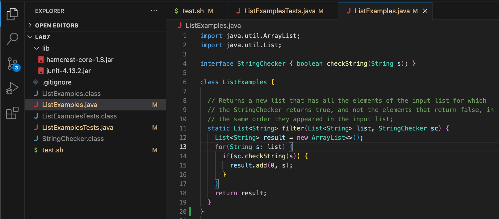
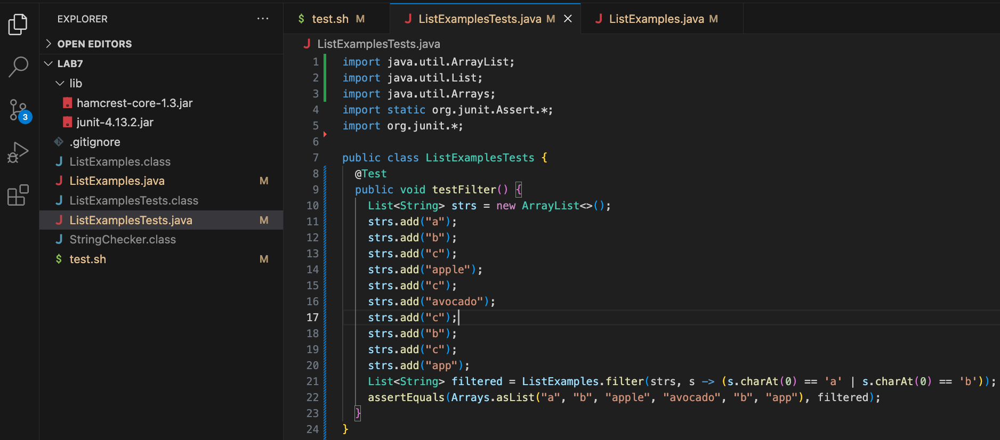
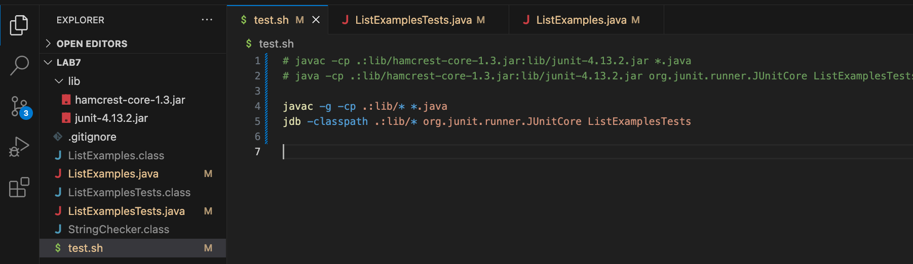
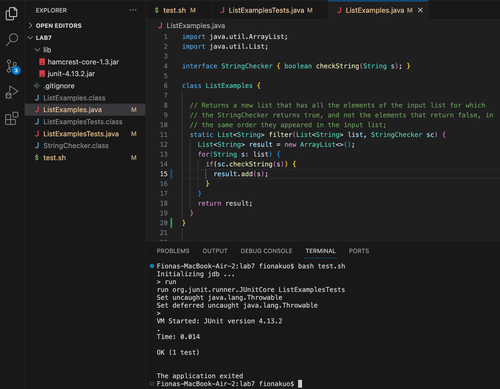

# Lab Report 5 - Putting it All Together (Week 9)

## Part 1 – Debugging Scenario
Design a debugging scenario, and write your report as a conversation on EdStem.
You should actually set up and run the scenario from your screenshots. It should involve at least a Java file and a bash script. Describing the bug should involve reading some output at the terminal resulting from running one or more commands. Design an error that produces more interesting output than a single message about a syntax or unbound identifier error – showcase some interesting wrong behavior! Feel free to set this up by cloning and breaking some existing code like the grading script or code from class, or by designing something of your own from scratch, etc.
It should have:

### 1.The original post from a student with a screenshot showing a symptom and a description of a guess at the bug/some sense of what the failure-inducing input is.
  - Student: Hi TA,
    I ran my program, but a failure-inducing ouput showed up and said `expected:<[a, b, apple, avocado, b, app]> but was:<[app, b, avocado, apple, b, a]>`. Based on the output message says `at ListExamplesTests.testFilter(ListExamplesTests.java:22)`, I am guessing that the symptom must be somehow triggered by line 22 of the `ListExamplesTests.testFilter` function in `ListExamplesTests.java`. I want to start on checking which part of the code trigger this symptom. Is there a step by step way to trace what stores in each variable without having to use `System.out.prinln(some_variable)` to print each variable? Thank you!
  
  - Here is the screenshot for the symptom output after executing the bash script `bash test.sh`:
    -  
   
  - Here are the screenshots of how my ListExamples.java and ListExamplesTests.java files look like:
    -  ListExamples.java: 
    -  ListExamplesTests.java: 

### 2. A response from a TA asking a leading question or suggesting a command to try (To be clear, you are mimicking a TA here.)
  - TA: Hi,
    A good way to trace what triggers a symptom is to use `jdb`, it allows you to visualize the process step by step.
    When you run `jdb`, you can stop at `ListExamplesTests.testFilter` first, then trace what each code line is doing, and use `next` command to execute to the next line in the current stack frame. Each code line you can use `print` to see what the variables look like, and from there you would be able to find which part of the codes has gone wrong throughout the tracing process.

### 3. Another screenshot/terminal output showing what information the student got from trying that, and a clear description of what the bug is.
  -  Student: Hi TA,
     Thanks for the guidance! After trying out `jdb`, I was able to identify what triggered the symptom more efficiently. It seems like the list variable called `filtered` in `ListExamplesTests.java` should be stored as `filtered = "[a, b, apple, avocado, b, app]"`, but it was stored reversely as `filtered = "[app, b, avocado, apple, b, a]"` instead because of the line 15 code `result.add(0, s);` from `ListExamplesTests.java`. I found that the reason why `result.add(0, s);` adds strings reversely to `filtered` is because the `0` represents the first position, so `result.add(0, s);` allows string `s` to be added to the front of the `result` list.

  - Here is the screenshot of the terminal output after trying `jdb`:
    -  
    -  
    -  
    -  
    -  

### 4. At the end, all the information needed about the setup including:
  - The file & directory structure needed:
    - 
      -  Absolute paths to each files(the files & directory structure):
            -  /Users/fionakuo/lab7/test.sh
            -  /Users/fionakuo/lab7/ListExamplesTests.java
            -  /Users/fionakuo/lab7/ListExamples.java
            -  /Users/fionakuo/lab7/ListExamples.class 
            -  /Users/fionakuo/lab7/ListExamplesTests.class
            -  /Users/fionakuo/lab7/StringChecker.class
            -  /Users/fionakuo/lab7/.gitignore
            -  /Users/fionakuo/lab7/lib/junit-4.13.2.jar
            -  /Users/fionakuo/lab7/lib/hamcrest-core-1.3.jar
  
      - All absolute path to each files in `lab7`:
        - 
   
  - The contents of each file before fixing the bug:
    -  ListExamples.java: 
    -  ListExamplesTests.java: 
    -  test.sh: 
   
  - The full command line (or lines) you ran to trigger the bug
    -  I put my command lines in a bash script called test, then I ran bash test.sh to trigger the bug.
    -  
    -  
   
  - A description of what to edit to fix the bug:
    - After following TA's guidance, the student was able to identify the list variable `filtered` was what triggered the symptom.
    - Symtom: Expected `filtered` was stored as `filtered = "[app, b, avocado, apple, b, a]"` instead of `filtered = "[a, b, apple, avocado, b, app]"`.
    - The line 15 code `result.add(0, s);` from `ListExamplesTests.java` was what caused the list variable `filtered` stored strings reversely. 
    - To fix the bug, I edited the line 15 code from `result.add(0, s);` to `result.add(s);`, so now `result.add(s);` adds strings to `filtered` in ascending order, e.g. `filtered = "[a, b, apple, avocado, b, app]"`.
    - This is how ListExamples.java looks like after fixing the bug and a successful output is printed:
      -  

  

## Part 2 – Reflection
In a couple of sentences, describe something you learned from your lab experience in the second half of this quarter that you didn’t know before. It could be a technical topic we addressed specifically, something cool you found out on your own building on labs, something you learned from a tutor or classmate, and so on. It doesn’t have to be specifically related to a lab writeup, we just want to hear about cool things you learned!

- I think the coolest thing I learned from the second half of this quarter was `vim`! `Vim` allows us to edit, navigate, and search for text more efficiently. For example, if I were to change a variable name that had been used many times in a file already. Usually, I would have to change each of them one by one. However, with `vim`, I could change all of them al at once with one command. Another cool thing I learned was putting command lines in a bash script, so we could run the command lines without typing or executing them one by one. I am extremely surprised by how these two tools have significantly improved my code editing process.

